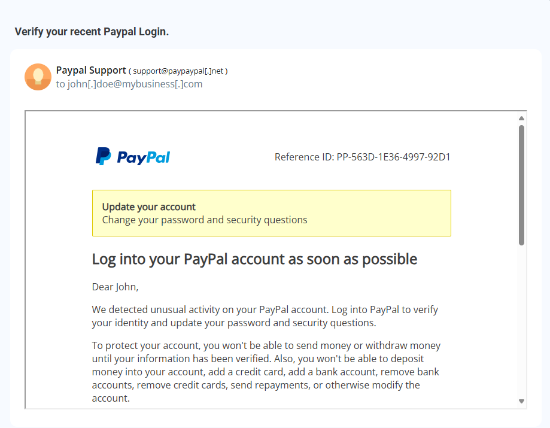
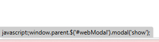

# Phishing Email Analysis Report

## 📧 Overview
This analysis was conducted using a phishing email emulator. The purpose is to identify potential phishing threats in a fake PayPal email.

---

## 🔍 Observations

### 1️⃣ Sender’s Details (Screenshot 1)
- The sender email appears suspicious (`support@payypal[.]net`) — it’s spoofed to look like a legit PayPal domain.
- Displayed as “Paypal Support” but domain is fake.

---

### 2️⃣ Mismatched Link (Screenshot 2)
- When hovering over the button, it shows a JavaScript function rather than a legitimate PayPal link:
  `javascript:window.parent.$('#webModal').modal('show');`
- This is a red flag — it hides the true destination.

---

### 3️⃣ Credential Theft Attempt (Screenshot 3)
- The redirect goes to a fake PayPal login page.
- It asks for email and password.
- If entered, these credentials would be stolen.

---

## ⚠️ Risks Identified
- **Spoofed email sender**
- **Link hiding using JavaScript**
- **Credential harvesting attempt**
- **Urgency used in message** — "Verify your recent PayPal login"
- **Generic structure mimicking PayPal**

---

## ✅ Conclusion
This is a **clear phishing attempt**. Entering your PayPal credentials on this fake page would compromise your account and possibly lead to financial loss.

Always **check email domains**, **hover before clicking links**, and **avoid acting on urgent requests without verification**.
